# Tài liệu Thiết kế Kỹ thuật - Trading Bot Platform

**Link:** https://coin98.atlassian.net/browse/AML-424 (Can't find link)

**Document Owner:** @Tuấn Nguyễn Anh
**Created on:** 2 Mar 2026
**Document Version:** 1.0.0

---

## Mục lục

1. Tổng quan dự án (Project Overview)
2. Luồng người dùng cốt lõi (Core User Flows)
   - 2.1. Thiết lập: Tạo Bot & Chiến lược (Setup: Bot & Strategy Creation)
   - 2.2. Kiểm thử: Backtesting (Validation & Result Review)
   - 2.3. Thực thi: Dry-run hoặc Live Trading (Execution: Dry-run/Live)
   - 2.4. Giám sát: Hiệu suất & Điều khiển (Monitoring & Control)
3. Ngăn xếp công nghệ & Kiến trúc (Tech Stack & Architecture)
4. Mô hình dữ liệu (Data Modeling - PostgreSQL)
   - 4.1. Bảng Users (Người dùng)
   - 4.2. Bảng Exchange_Credentials (Thông tin sàn)
   - 4.3. Bảng Bot_Instances (Thực thể Bot)
   - 4.4. Bảng Strategies (Chiến lược)
   - 4.5. Bảng Backtest_History (Lịch sử kiểm thử)
5. Thiết kế API Endpoints (Core API Endpoints)
   - 5.1. Người dùng & Xác thực (/user)
   - 5.2. Quản lý Bot (/bot)
   - 5.3. Quản lý Chiến lược (/strategy)
   - 5.4. Kiểm thử lịch sử (Backtesting) (/backtest)
6. Xử lý Logic cốt lõi (Integration)
7. Nguyên tắc Bảo mật (Security Guardrails)
8. Đảm bảo chất lượng & Kiểm thử (Testing & QA)

---

## 1. Tổng quan dự án (Project Overview)

**Mục tiêu:** Phát triển một nền tảng bot giao dịch mạnh mẽ và tích hợp trực tiếp vào hệ thống giao dịch hiện có. Hệ thống cung cấp khả năng cho người dùng khởi tạo bot, cấu hình chiến lược giao dịch, thực hiện kiểm thử lịch sử (backtest) và vận hành bot giao dịch thực tế (Live Trading/Dry-run).

---

## 2. Luồng người dùng cốt lõi (Core User Flows)

```mermaid
sequenceDiagram
   autonumber
   actor User as User
   participant FE as Frontend (Streamlit)
   participant API as Backend API (FastAPI)
   participant DB as Database (Postgres)
   participant S3 as S3 Storage (AWS)
   participant Bot as Trading Bot Process
   participant EX as Exchange API


   rect rgb(240, 240, 240)
       Note over User, API: 1. Authentication & Profile
       User->>FE: Opens Web & Connect Wallet
       FE->>API: POST /user/login
       activate API
       API->>DB: Query User / Verify Password
       DB-->>API: User Record
       API-->>FE: JWT Token
       deactivate API
       FE-->>User: Displays Dashboard & Active Bots
   end


   rect rgb(230, 245, 255)
       Note over User, EX: 2. Bot Setup & Configuration (Wizard)
       User->>FE: Selects "Create New Bot"
       FE-->>User: Shows Step 1: Basic Info Form
       User->>FE: Inputs Name, Strategy Name, Initial State
       FE-->>User: Shows Step 2: Trading Configurations Form
       User->>FE: Inputs Trading Mode, Pair, Amount
       FE-->>User: Shows Step 3: Exchange Configurations Form
       User->>FE: Exchange Selection, Input Exchange API key
       FE-->>User: Shows Step 4: Notification Configuration Form
       User->>FE: Inputs Telegram Token, Chat ID
       FE-->>User: Shows Step 5: AI Settings Form
       User->>FE: Config AI Settings
       User->>FE: Clicks "Create Bot & Setup Strategy"

       FE->>API: POST /bot/create (Payload with Wizard Data)
       activate API
       API->>API: build_bot_config()
       API->>S3: Upload config.json (JSON file contains un-hashed Exchange API key)
       API->>DB: Save Bot Instance Metadata
       API->>DB: Save Hashed Exchange API keys
       API-->>FE: Bot Created (ID: {id})
       deactivate API
       FE-->>User: Shows "Bot Created" & Navigates to Strategy Wizard
   end


   rect rgb(235, 255, 235)
       Note over User, EX: 3. Strategy Design & Drafts
       FE-->>User: Shows Strategy Wizard (Indicators/Risk/Signals)

       loop Every 60 seconds
           FE->>API: POST /strategy/draft (Auto-save form state)
           API->>S3: Store Draft State (JSON)
       end


       User->>FE: Selects Indicators
       User->>FE: Defines Entry/Exit Logic
       FE-->>User: Shows Live Logic Preview (AND/OR groups)

       User->>FE: Clicks "Save & Generate Strategy"
       FE->>API: POST /strategy/create
       activate API
       API->>DB: Save Strategy metadata
       API->>API: strategy_codegen.py (Generate Python Code)
       API->>S3: Upload {Strategy}.py
       API-->>FE: Strategy Attached Successfully
       deactivate API
       FE-->>User: Shows Strategy Summary & Success Message
   end


   rect rgb(255, 245, 230)
       Note over User, EX: 4. Backtesting & Optimization
       User->>FE: Navigates to "Backtesting" & Selects Bot
       FE-->>User: Displays Date Range Selection
       User->>FE: Clicks "Run Backtest"

       FE->>API: POST /backtest/start
       activate API
       API->>Bot: Launch Simulation Engine
       Bot->>S3: Pull Data & Strategy
       Bot-->>API: simulation_results.json
       API->>S3: Upload Results (.zip)
       API->>DB: Save BacktestHistory
       API-->>FE: Backtest Completed
       deactivate API
       FE-->>User: Renders Performance Charts (Profit/Drawdown/Trades)


       Note right of User: Iterative Optimization
       User->>FE: Adjusts Strategy Parameters in Wizard
       FE->>API: PATCH /strategy/detail/{id}
       API->>API: Regenerate Python Code & Update S3
       API-->>FE: Strategy Updated
       FE-->>User: Ready for Next Backtest
   end


   rect rgb(255, 235, 235)
       Note over User, EX: 5. Bot Execution (Go Live)
       User->>FE: Clicks "Start Bot" (Running Mode)
       FE->>API: POST /bot/{id}/start
       activate API
       API->>Bot: Launch Trading Bot Process
       activate Bot
       Bot->>S3: Download config & strategy
       Bot->>EX: Establish Live REST/WS Session
       deactivate Bot
       API->>DB: Update status to 'running'
       API-->>FE: Bot Status: running
       deactivate API
       FE-->>User: Shows Live Status Indicator (Green)
   end


   rect rgb(245, 235, 255)
       Note over User, EX: 6. Monitoring & Live Control
       loop Every 5 seconds
           FE->>API: GET /bot/{id}/status (Stats/Logs)
           API->>Bot: Call Bot REST API
           Bot-->>API: Live Profit / Open Trades / Logs
           API-->>FE: Payload
           FE-->>User: Updates Real-time Dashboard
       end


       Note over User, EX: Manual Risk Intervention
       User->>FE: Clicks "Manual Trading"
       User->>FE: Input custom stoploss
       FE->>API: POST /bot/{id}/set_stoploss
       API->>Bot: Call Bot REST API /trade/stoploss
       Bot->>EX: Update SL on Exchange
       User->>FE: Clocks "Force Entry" / "Force Exit"
       FE->>API: POST /bot/{id}/force_entry (or /force_exit)
       activate API
       API->>Bot: Call Bot REST API /forceexit
       activate Bot
       Bot->>EX: Execute Market Sell Order
       EX-->>Bot: Order Confirmed
       deactivate Bot
       Bot-->>API: Success
       API-->>FE: Trade Executed
       deactivate API
       FE-->>User: Shows Notification: "Position Closed Successfully"
   end
```

*Trading Bot Sequence Diagram - Mermaid Editor*

Quy trình làm việc của người dùng trên nền tảng tuân theo chu kỳ từ thiết lập đến thực thi và giám sát:

### 2.1. Thiết lập: Tạo Bot & Chiến lược (Setup: Bot & Strategy Creation)

- **Tạo Bot:** Người dùng khởi tạo một thực thể Bot bằng cách chọn sàn giao dịch (nhập API Key) và thiết lập các thông số cơ bản (cặp tiền, khung thời gian, quản trị rủi ro).
- **Tạo & Gắn Chiến lược:** Người dùng định nghĩa các chỉ báo (Indicators) và quy tắc mua/bán (Entry/Exit logic) thông qua giao diện để gắn vào Bot.
- **Lưu bản nháp (Drafts):** Hệ thống hỗ trợ tự động lưu bản nháp (Auto-save) mỗi 30 giây vào thư mục riêng của Bot để người dùng có thể tạm dừng và tiếp tục cấu hình bất cứ lúc nào.
- **Sinh mã nguồn:** Sau khi hoàn tất, hệ thống tự động sinh mã nguồn Python (.py) tương thích với Công cụ giao dịch và cập nhật vào cấu hình của Bot.

### 2.2. Kiểm thử: Backtesting (Validation & Result Review)

- **Thực thi:** Người dùng yêu cầu Backtest trên dữ liệu lịch sử. Hệ thống kiểm tra/tải dữ liệu OHLCV (.feather) từ sàn và chạy tác vụ ở nền.
- **Xem xét kết quả (Result Review):** Sau khi hoàn thành, người dùng có thể phân tích sâu hiệu quả chiến lược thông qua:
  - **Biểu đồ OHLC trực quan:** Hiển thị nến giá cùng với các chỉ báo kỹ thuật (Indicators) đã sử dụng trong chiến lược.
  - **Điểm vào/ra lệnh (Entry/Exit Points):** Đánh dấu vị trí các lệnh mua/bán (Long/Short) trực tiếp trên biểu đồ để đối chiếu với logic chiến lược.
  - **Số liệu tổng hợp:** Lợi nhuận, tỉ lệ thắng, mức sụt giảm tài sản (Drawdown) và danh sách chi tiết các vị thế đã đóng.

### 2.3. Thực thi: Dry-run hoặc Live Trading (Execution: Dry-run/Live)

- Người dùng kích hoạt Bot ở chế độ Dry-run (giao dịch giả lập) hoặc Live Trading (giao dịch thực tế).
- Hệ thống thiết lập môi trường thực thi bảo mật và khởi chạy tiến trình Công cụ giao dịch riêng biệt cho từng Bot.

### 2.4. Giám sát: Hiệu suất & Điều khiển (Monitoring & Control)

- **Theo dõi:** Người dùng giám sát các lệnh đang mở (Open Trades), lợi nhuận thực tế và nhật ký (Logs) của Bot thông qua Dashboard.
- **Điều khiển:** Người dùng có quyền can thiệp trực tiếp như: Đóng lệnh thủ công (Force Exit), Mở lệnh thủ công (Force Entry) hoặc Dừng Bot bất cứ lúc nào.

---

## 3. Ngăn xếp công nghệ & Kiến trúc (Tech Stack & Architecture)

- **Ngôn ngữ:** Python 3.11+
- **Web Framework:** FastAPI (tối ưu cho API bất đồng bộ, hiệu suất cao).
- **Cơ sở dữ liệu:** PostgreSQL (SQLAlchemy 2.0).
- **Lưu trữ dữ liệu (Storage):** AWS S3 (Lưu trữ tập trung dữ liệu nến OHLCV, file chiến lược và kết quả backtest).
- **Quản lý tiến trình:** Python Subprocess & Threading (Giám sát và vận hành bot).
- **Kiến trúc dự án (Pragmatic Clean Architecture):** Chia ranh giới nghiêm ngặt:
  - `api/`: Các router và endpoint của FastAPI.
  - `services/`: Logic nghiệp vụ cốt lõi (gọi Công cụ giao dịch, xử lý dữ liệu, quản lý tiến trình).
  - `models/`: Schema cơ sở dữ liệu (SQLAlchemy) và Schema xác thực (Pydantic).
  - `core/`: Cấu hình hạ tầng, bảo mật, và kết nối Database.

---

## 4. Mô hình dữ liệu (Data Modeling - PostgreSQL)

Hệ thống sử dụng PostgreSQL với SQLAlchemy ORM. Dưới đây là chi tiết các bảng cốt lõi:

### 4.1. Bảng Users (Người dùng)

| Trường | Kiểu dữ liệu | Mô tả |
|---|---|---|
| id | Integer (PK) | Định danh duy nhất của người dùng. |
| email | String (Unique) | Địa chỉ email dùng để đăng nhập. |
| hashed_password | String | Mật khẩu đã được mã hóa (Bcrypt). |
| is_active | Boolean | Trạng thái tài khoản (True: đang hoạt động). |
| is_admin | Boolean | Quyền quản trị viên. |
| created_at | DateTime | Thời điểm tạo tài khoản. |

### 4.2. Bảng Exchange_Credentials (Thông tin sàn)

| Trường | Kiểu dữ liệu | Mô tả |
|---|---|---|
| id | Integer (PK) | Định danh duy nhất. |
| user_id | Integer (FK) | Liên kết tới bảng Users. |
| exchange_name | String | Tên sàn (ví dụ: binance, kraken). |
| api_key | String (Encrypted) | API Key đã được mã hóa đối xứng. |
| api_secret | String (Encrypted) | API Secret đã được mã hóa đối xứng. |

### 4.3. Bảng Bot_Instances (Thực thể Bot)

| Trường | Kiểu dữ liệu | Mô tả |
|---|---|---|
| id | Integer (PK) | Định danh duy nhất của bot. |
| user_id | Integer (FK) | Chủ sở hữu bot. |
| bot_name | String | Tên định danh của bot. |
| strategy_name | String | Tên chiến lược đang được gắn với bot. |
| status | String (Enum) | Trạng thái: running, stopped, error. |
| config_override | JSONB | **Source of Truth:** Lưu trữ toàn bộ tham số cấu hình bot (pairs, timeframe, stake_amount, stoploss, v.v.). Dữ liệu này dùng để sinh file config.json khi chạy. |
| last_run_at | DateTime | Lần cuối cùng bot được khởi chạy. |

### 4.4. Bảng Strategies (Chiến lược)

| Trường | Kiểu dữ liệu | Mô tả |
|---|---|---|
| id | Integer (PK) | Định danh duy nhất. |
| user_id | Integer (FK) | Người tạo chiến lược. |
| bot_id | Integer (FK) | Liên kết tới bot đang sử dụng chiến lược này. |
| name | String | Tên lớp (Class name) của chiến lược. |
| description | Text | Mô tả chi tiết. |
| configurations | JSONB | **Source of Truth:** Chứa logic chi tiết (indicators, entry/exit signals). Dùng để sinh mã nguồn .py tự động. |
| strategy_type | String | Loại: statistical, ai_powered. |

### 4.5. Bảng Backtest_History (Lịch sử kiểm thử)

| Trường | Kiểu dữ liệu | Mô tả |
|---|---|---|
| id | Integer (PK) | Định danh duy nhất. |
| user_id | Integer (FK) | Người thực hiện backtest. |
| bot_id | Integer (FK) | Bot được dùng để chạy backtest. |
| status | String | Trạng thái: running, completed, failed. |
| trade_count | Integer | Tổng số lệnh đã thực hiện trong backtest. |
| total_profit | Float | Tổng lợi nhuận (tỉ lệ phần trăm). |
| result_file_path | String | Đường dẫn lưu tệp kết quả chi tiết (JSON/ZIP) trong Storage (S3/Local). |

---

## 5. Thiết kế API Endpoints (Core API Endpoints)

Tất cả endpoint phải trả về chuẩn HTTP Status Codes và dùng Pydantic để validate Request/Response.

### 5.1. Người dùng & Xác thực (/user)

- `POST /user/create`: Đăng ký tài khoản người dùng mới.
- `POST /user/login`: Xác thực và nhận mã JWT access token.
- `GET /user/status`: Lấy thông tin hồ sơ của người dùng hiện tại.

### 5.2. Quản lý Bot (/bot)

- `POST /bot/create`: Tạo bot mới với cấu hình sàn và chiến lược.
- `GET /bot/list`: Liệt kê danh sách các bot (tự động đồng bộ trạng thái thực tế giữa DB và tiến trình).
- `GET /bot/{bot_id}/config`: Xem cấu hình hiện tại của bot (đã ẩn API Key).
- `PATCH /bot/{bot_id}/config`: Cập nhật các thông số vận hành (cặp tiền, stoploss, mức vốn).
- `GET /bot/{bot_id}/status`: Kiểm tra trạng thái chi tiết của bot (Running, Stopped, Error).
- `POST /bot/{bot_id}/start`: Kích hoạt tiến trình Công cụ giao dịch cho bot.
- `POST /bot/{bot_id}/stop`: Dừng tiến trình bot một cách an toàn.
- `GET /bot/{bot_id}/logs`: Truy xuất nhật ký hoạt động gần nhất của bot để chẩn đoán lỗi.

**Điều khiển & Giám sát trực tiếp (Real-time Monitoring):**

- `GET /bot/{bot_id}/open_trades`: Truy xuất danh sách các vị thế đang mở (Open Positions) cùng lợi nhuận thực tế (Real-time Profit) từ bot.
- `POST /bot/{bot_id}/force_exit`: Đóng thủ công một vị thế đang mở cụ thể.
- `POST /bot/{bot_id}/force_entry`: Ra lệnh cho bot mở thủ công một vị thế mới cho một cặp tiền.
- `POST /bot/{bot_id}/set_stoploss`: Điều chỉnh mức dừng lỗ (Stoploss) cho một lệnh đang chạy mà không cần khởi động lại bot.

### 5.3. Quản lý Chiến lược (/strategy)

- `GET /strategy/form-schema`: Lấy JSON Schema để dựng giao diện tạo chiến lược động.
- `POST /strategy/create`: Tạo chiến lược mới và sinh mã nguồn Python.
- `PATCH /strategy/detail/{strategy_id}`: Cập nhật logic chiến lược.
- `POST /strategy/draft`: Tự động lưu cấu hình chiến lược hiện tại (Draft/Auto-save) theo Bot ID.
- `GET /strategy/draft/{bot_id}/{name}`: Tải bản nháp chiến lược cụ thể của một Bot.

### 5.4. Kiểm thử lịch sử (Backtesting) (/backtest)

- `POST /backtest/start`: Khởi chạy quá trình kiểm thử lịch sử cho một bot và chiến lược cụ thể.
- `GET /backtest/history`: Liệt kê danh sách các lần kiểm thử đã thực hiện kèm số liệu tóm tắt (Lợi nhuận, tỉ lệ thắng, số lượng lệnh).
- `GET /backtest/{backtest_id}`: Lấy toàn bộ kết quả chi tiết của một lần kiểm thử, bao gồm payload JSON chứa danh sách các lệnh giao dịch (điểm vào/ra, giá, lợi nhuận từng lệnh) phục vụ việc phân tích và vẽ biểu đồ.
- `DELETE /backtest/{backtest_id}`: Xóa bản ghi lịch sử kiểm thử khỏi hệ thống.

---

## 6. Xử lý Logic cốt lõi (Integration)

- **Lưu trữ tập trung:** Toàn bộ dữ liệu người dùng bao gồm tệp nến (.feather), cấu hình bot, mã nguồn chiến lược (.py) và báo cáo kiểm thử được lưu trữ trên AWS S3 thay vì đĩa cục bộ.
- **Đồng bộ hóa:** Trước khi khởi chạy Bot hoặc Backtest, hệ thống thực hiện đồng bộ dữ liệu cần thiết từ S3 về thư mục làm việc tạm thời của tiến trình.
- **Quản lý tiến trình (Process Management):** Hệ thống sử dụng lớp ProcessManager để khởi chạy và quản lý các bot như các tiến trình con (Subprocesses) độc lập. Mỗi bot sẽ có một định danh riêng để theo dõi trạng thái.
- **Giám sát sức khỏe (Health Monitoring):** Một luồng chạy nền (Background Thread) thực hiện kiểm tra trạng thái của tất cả các bot đang hoạt động mỗi 60 giây và tự động khởi động lại nếu gặp lỗi mạng hoặc API tạm thời.
- **Bảo mật API Key:** API Key/Secret được giải mã ngay trong bộ nhớ và truyền vào tệp cấu hình tạm thời, tệp này được xử lý bảo mật ngay sau khi tiến trình bắt đầu.

---

## 7. Nguyên tắc Bảo mật (Security Guardrails)

- **Quản lý Secret:** KHÔNG hardcode API keys, JWT secret. Đọc qua file .env.
- **Mã hóa Khóa Sàn:** API Key/Secret của user phải được mã hóa đối xứng (Symmetric Encryption) trước khi lưu vào DB.
- **Bảo mật Row-Level:** User X KHÔNG THỂ xem, sửa hoặc chạy Bot của User Y.

---

## 8. Đảm bảo chất lượng & Kiểm thử (Testing & QA)

- **Unit Tests:** Sử dụng pytest cho các kịch bản thành công và lỗi.
- **No-Mock Policy:** Sử dụng Database test thực tế (Dockerized Postgres) thay vì mock DB.
- **Mock Công cụ giao dịch:** Có thể mock tiến trình Công cụ giao dịch để kiểm tra logic API nhanh hơn.
